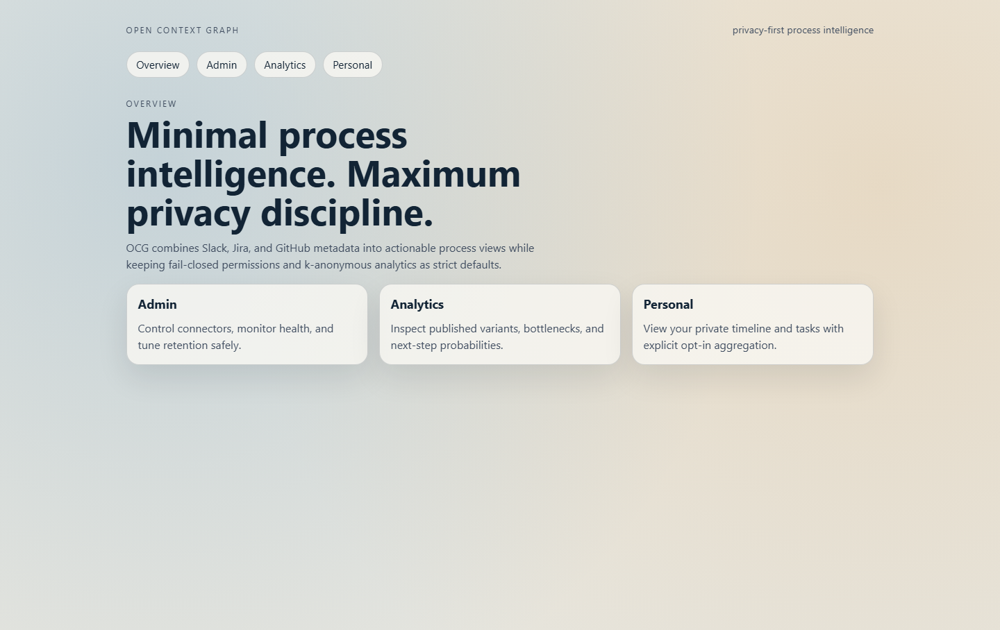
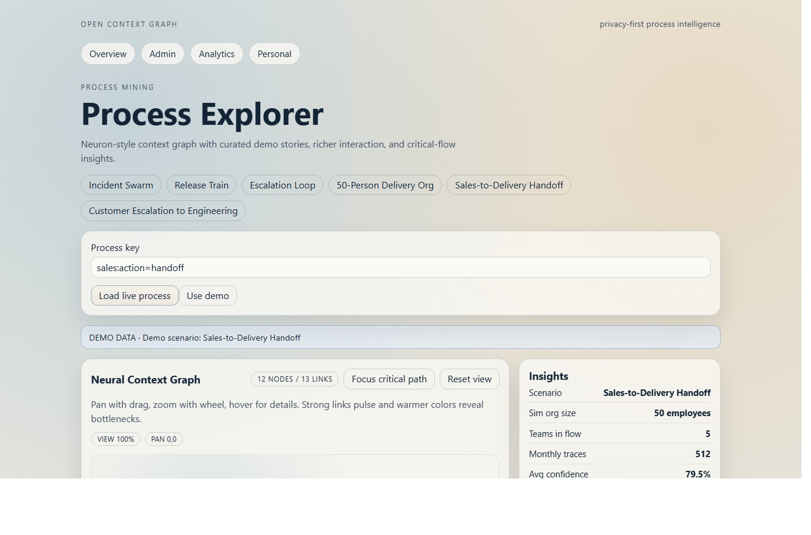
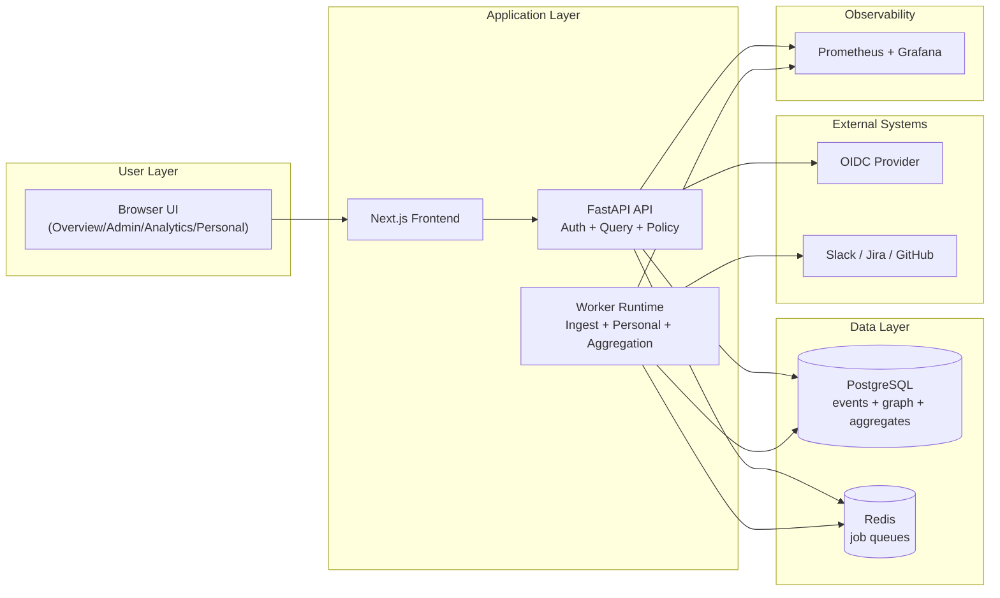

# Open Context Graph (OCG)

[](https://github.com/aliuyar1234/ContextGraph/actions/workflows/ci.yml)
[](https://github.com/aliuyar1234/ContextGraph/tags)
[](LICENSE)
[](frontend/package.json)
[](backend/pyproject.toml)
[](README.md#quick-start-docker-compose)

Open Context Graph is a self-hosted, privacy-aware process intelligence platform built from Slack, Jira, and GitHub metadata.
It combines fail-closed permission enforcement, private personal timelines, and k-anonymous analytics so teams can improve execution without creating surveillance risk.

## What This Project Is
- A self-hosted process intelligence platform for engineering and operations teams.
- Built from enterprise metadata streams (Slack, Jira, GitHub), not employee surveillance.
- Privacy-first by design: fail-closed permissions, private personal views, k-anonymous aggregation.

## Demo story screenshots (desktop)
Overview:



Sales-to-Delivery handoff:



## Architecture overview (Mermaid)


| Layer | What it contains |
|---|---|
| `backend/` | FastAPI service, domain services, migrations, CLI, worker runtime |
| `frontend/` | Next.js dashboards (`/admin`, `/analytics`, `/personal`) |
| `ops/` | Prometheus scrape config, alert rules, Grafana dashboards |
| `docs/openapi/` | OpenAPI compatibility baseline artifact |
| `spec/` | Normative SSOT contracts, gates, runbook, and acceptance plan |

## Technical Guide
Legacy note: Table of contents intentionally removed for skim-first README flow.

## Quick start (Docker Compose)
Prerequisites:
- Docker + Docker Compose
- Make

Start services:
```bash
docker compose up -d postgres redis api workers scheduler ui
```

Initialize database and demo data:
```bash
docker compose exec api ocg migrate up
docker compose exec api ocg seed demo
```

Validate health:
```bash
curl -f http://127.0.0.1:8080/healthz
curl -f http://127.0.0.1:8080/readyz
```

Open interfaces:
- UI: `http://127.0.0.1:3000`
- API docs: `http://127.0.0.1:8080/docs`
- Metrics: `http://127.0.0.1:8080/metrics`

## Local development
Backend:
```bash
python -m pip install -e "backend[dev]"
PYTHONPATH=backend python -m ocg.cli migrate up
PYTHONPATH=backend uvicorn ocg.main:app --host 127.0.0.1 --port 8080 --reload
```

Frontend:
```bash
npm --prefix frontend install
npm --prefix frontend run dev
```

## Configuration essentials
| Variable | Purpose |
|---|---|
| `OCG_DATABASE_URL` | SQLAlchemy database connection string |
| `OCG_REDIS_URL` | Redis URL for queueing/runtime state |
| `OCG_SECURITY_ENABLE_OIDC` | Enables JWT/OIDC validation for non-local use |
| `OCG_DEV_AUTH_ENABLED` | Optional local-only dev header auth override |
| `OCG_RAW_CONTENT_ENABLED` | Controls raw content ingestion mode |
| `OCG_RETENTION_DAYS` | Retention horizon for stored metadata |

## Quality workflow
Use one anchor command for all verification:

- Fast profile: `make check CHECK_PROFILE=fast`
- CI-equivalent profile: `make check CHECK_PROFILE=ci`
- Full profile: `make check CHECK_PROFILE=full`

`CHECK_PROFILE=ci|full` is strict. Required checks and toolchains cannot silently skip.

The quality pipeline covers:
- format
- lint (+ docs guard)
- typecheck
- frontend production build (`ci`/`full`)
- unit + integration tests (profile-gated)
- migration checks
- secret and redaction scans
- OpenAPI compatibility (`ci`/`full`)

## Worker operations
```bash
PYTHONPATH=backend python -m ocg.cli worker run
PYTHONPATH=backend python -m ocg.cli worker scheduler --once
PYTHONPATH=backend python -m ocg.cli worker stats
```

## API surfaces
- Health and metrics:
  - `GET /healthz`
  - `GET /readyz`
  - `GET /metrics`
- Admin:
  - `/api/v1/admin/connectors/*`
- Personal:
  - `/api/v1/personal/timeline`
  - `/api/v1/personal/tasks`
  - `/api/v1/personal/opt_in_aggregation`
- Analytics:
  - `/api/v1/analytics/processes/*`
  - `/api/v1/analytics/patterns/*`
- Suggestions:
  - `POST /api/v1/suggest/next_steps`

## Security and privacy defaults
- Fail-closed permissions: unknown ACL state is excluded from user-visible output.
- OIDC validation is mandatory for non-local bind startup.
- Raw-content ingestion is disabled by default.
- Aggregate analytics publish only at or above k-anonymity threshold.
- Dev header auth mode is disabled by default and intended for local/demo workflows only.

## Observability
- Request trace correlation via `X-Trace-Id` and `traceparent`.
- Prometheus metrics on `/metrics`.
- Dashboards and alerts under `ops/grafana/` and `ops/prometheus/`.

## Contributing
1. Create a branch from `main`.
2. Keep changes scoped and update SSOT docs when critical surfaces change.
3. Run `make check CHECK_PROFILE=ci` locally.
4. Open a PR with explicit evidence pointers for acceptance criteria.

## Where to find X (index)
- Goals / constraints / invariants:
  - evidence: spec/00_PROJECT_FINGERPRINT.md :: Canonical summary (1 screen)
- Scope and MVP boundaries:
  - evidence: spec/01_SCOPE.md :: MVP definition (ship threshold)
- Architecture boundaries and critical/hot paths:
  - evidence: spec/02_ARCHITECTURE.md :: Component boundary table (normative)
  - evidence: spec/02_ARCHITECTURE.md :: HOT_PATHS (HP) (normative)
- Domain model and privacy invariants:
  - evidence: spec/03_DOMAIN_MODEL.md :: Permission and privacy invariants (normative)
- REST contracts and compatibility:
  - evidence: spec/04_INTERFACES_AND_CONTRACTS.md :: REST API (normative)
- Datastore schema and migration rules:
  - evidence: spec/05_DATASTORE_AND_MIGRATIONS.md :: Schema overview (normative)
- Security posture, trust boundaries, abuse cases:
  - evidence: spec/06_SECURITY_AND_THREAT_MODEL.md :: Trust boundaries (normative)
  - evidence: spec/06_SECURITY_AND_THREAT_MODEL.md :: TOP_ABUSE_CASES (AC) (>=10; normative)
- Reliability semantics:
  - evidence: spec/07_RELIABILITY_AND_OPERATIONS.md :: Reliability principles (normative)
- Metrics/traces/dashboards:
  - evidence: spec/08_OBSERVABILITY.md :: Signals that prove correctness (contracts C1-C5)
- Deterministic test strategy:
  - evidence: spec/09_TEST_STRATEGY.md :: Determinism expectations (normative)
- Task plan and delivery checkpoints:
  - evidence: spec/10_PHASES_AND_TASKS.md :: PHASE_0_BOOTSTRAP (repo + CI + docs-as-code)
- Quality gates:
  - evidence: spec/11_QUALITY_GATES.md :: Gate format
- Day-0 operations and incidents:
  - evidence: spec/12_RUNBOOK.md :: Top 5 incident playbooks
- Decision and assumption logs:
  - evidence: DECISIONS.md :: Decisions (append-only)
  - evidence: ASSUMPTIONS.md :: Assumptions (append-only)
- Progress and evidence of completion:
  - evidence: PROGRESS.md :: Task status table

## Drift detection
- `MANIFEST.sha256` is the repository integrity root.
- Any content change requires:
  1) update `CHANGELOG.md` and `AUDIT_REPORT.md`,
  2) regenerate `MANIFEST.sha256`,
  3) verify manifest consistency.
- Verification reference:
  - evidence: checks/CHECKS_INDEX.md :: CHK-MANIFEST-VERIFY

## Governance
Precedence order (MUST be applied verbatim):
1) AGENTS.md
2) CONSTITUTION.md
3) spec/* (numeric order; existing files only)
4) DECISIONS.md
5) ASSUMPTIONS.md
6) README.md
7) templates/*, checks/*, runbook content
